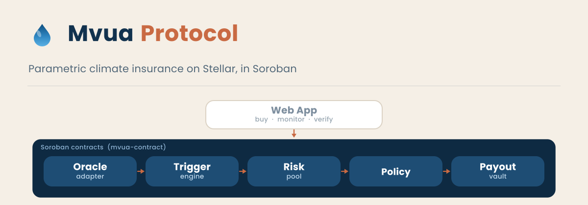

<p align="center">
  
</p>

<h1 align="center">Mvua Protocol Contracts</h1>

<p align="center">
  <a href="./.github/workflows/ci.yml"></a>
  <a href="./LICENSE"></a>
  
  
</p>

<p align="center">
  <b>Parametric climate insurance for the people who feed us, built on <a href="https://stellar.org">Stellar</a> with <a href="https://soroban.stellar.org">Soroban</a>.</b>
</p>

Mvua lets smallholder farmers and climate exposed communities buy micro insurance policies in USDC, and pays out automatically when on chain weather data crosses a predefined index trigger. No claims adjusters, no paperwork: a failed season becomes a payout in minutes, not months.

> Status: **pre alpha**, in active development. Contracts are not deployed to mainnet. Everything currently targets Stellar testnet.

<!-- PLACEHOLDER_BODY -->

## This repository in the whole project

Mvua Protocol is built as separate repositories under the [Mvua-Protocol](https://github.com/Mvua-Protocol) organization. **This repository is the on chain core**: the Soroban smart contracts that hold funds, verify weather data, decide payouts, and move money. Everything financial happens here.

| Layer | Repository | What it does |
|---|---|---|
| Interface | [`mvua-app`](https://github.com/Mvua-Protocol/mvua-app) | Web app: pool dashboards, policy purchase, payout explorer. |
| **On chain core** | **`mvua-contract`** (this repo) | **Risk pools, policies, oracle adapter, trigger engine, payout vault.** |

The banner above shows the picture: the web app is the window, and these contracts are the machine behind it. The app never holds funds or decides outcomes; it only reads state and submits signed transactions. The contracts are the source of truth.

## Why parametric insurance

Traditional insurance needs loss assessors, forms, and disputes, which makes small policies uneconomical. Parametric insurance pays on an objective, measurable index instead: cumulative rainfall, consecutive dry days, or vegetation health. The index is the contract. Farmers get paid when the data says the season failed, and anyone can verify every payout on chain.

## Architecture

```
                      ┌─────────────────────────┐
                      │   Weather data sources   │
                      │  Open-Meteo / NOAA /     │
                      │  satellite (NDVI)        │
                      └───────────┬─────────────┘
                                  │ signed observations (ed25519)
                                  ▼
┌──────────┐  premium   ┌──────────────────┐  median  ┌──────────────────┐
│  Farmer  │──────────►│     Risk Pool     │◄─────────│  Oracle Adapter   │
│ (USDC)   │           │  junior/senior    └──────────┤ publisher registry│
└────┬─────┘           │  tranches, fees     │        └────────┬─────────┘
     │ policy NFT      └─────────┬──────────┘                  │ index series
     ▼                           │ reserves                    ▼
┌──────────┐            ┌───────▼─────────┐          ┌──────────────────┐
│  Policy  │            │   Payout Vault   │◄─────────│  Trigger Engine   │
│ (NFT)    │            │ claimable balance│  payout  │ index definitions │
└──────────┘            │     batches      │  list    │ severity curves   │
                        └──────────────────┘          └──────────────────┘
```

- **Risk pool**: holds premiums and tranche capital in USDC. The junior tranche takes first loss; the senior tranche is protected. Solvency is an enforced invariant, not a promise.
- **Policy**: each policy is a non fungible certificate carrying coverage amount, region, window, and severity curve.
- **Oracle adapter**: independent publishers sign weather observations; the contract verifies ed25519 signatures and aggregates a median. Stale data blocks triggers rather than firing them.
- **Trigger engine**: deterministic index formulas (rainfall shortfall, consecutive dry days, NDVI drop) evaluated against the oracle series.
- **Payout vault**: resumable batch payouts into Stellar claimable balances, so farmers never need XLM for fees.

## Crates

The workspace is a set of focused Soroban contract crates plus shared support crates.

| Crate | Role | Status |
|---|---|---|
| `common` | Shared error codes, value types, basis point math, and storage TTL helpers | shared, in use |
| `risk-pool` | Pool creation, tranches, premiums, season lifecycle, settlement | **implemented** (see below) |
| `policy` | Policy certificates and lifecycle | **implemented** (see below) |
| `oracle-adapter` | Publisher registry, ed25519 signed observations, median aggregation | scaffolded |
| `trigger-engine` | Index definitions and deterministic evaluation | scaffolded |
| `payout-vault` | Resumable batch payouts to claimable balances, pause | scaffolded |
| `test-utils` | Shared test fixtures, scenario builders, mock publishers | shared, in use |

"scaffolded" means the crate compiles with its storage layout (`DataKey`) and error model (`#[contracterror]`) in place and a constructor, with business logic landing in later sprints. See [`docs/ARCHITECTURE.md`](docs/ARCHITECTURE.md) for the authoritative storage and error tables.

### risk-pool: what is implemented

The risk pool is the furthest along. It currently supports the full capital and season lifecycle:

- **Pools and tranches**: `create_pool`, `deposit`, and `withdraw` across a junior (first loss) and senior tranche, tracked with per holder receipts that behave like internal share balances.
- **Season lifecycle**: `open_season`, `activate_season`, `close_season`, and `settle_season` move a season through Open, Active, Closed, and Settled states with guarded transitions.
- **Premium intake**: `collect_premium` accepts USDC premiums into an active season, splitting a capped protocol fee into a separate treasury from the reserves that back payouts.
- **Settlement waterfall**: `settle_season` applies an asymmetric waterfall. Surplus flows entirely to the junior tranche; losses are absorbed junior first, then senior, with any residual beyond both left unabsorbed. Profit and loss reallocate tranche capital, which changes receipt share price, rather than touching reserves directly.
- **Reads**: `pool_config`, `tranche`, `receipt`, `solvency`, `season`, and `treasury` expose state for the app and indexer.

Full rationale for the settlement model is recorded in the design decision log (private planning repo, DR-0021).

### policy: what is implemented

The policy contract is the buyer facing certificate and its lifecycle. It holds no value itself: premiums flow into the risk pool and refunds flow back out of it.

- **Quote and mint**: `quote` prices coverage against the pool's provisional linear curve, and `mint` re-quotes, checks the price against the buyer's `max_premium`, collects the premium into the risk pool, and mints an `Active` certificate recording the gross paid and the net reserved.
- **Lifecycle**: a forward state machine, `Active` to `Triggered` to `Paid` for a claim, `Active` to `Expired` after the coverage window, and `Active` to `Cancelled` before it opens. `mark_triggered` and `mark_paid` are guardian only; `expire` is permissionless once the window has ended.
- **Cancellation**: an owner may `cancel` before the coverage window opens, which refunds the reserved net premium from the risk pool (fees already accrued to the treasury are not reversed).
- **Off chain metadata**: each policy carries an opaque `BytesN<32>` pointer (`set_metadata`, `metadata`) that resolves off chain, so no personally identifying information is ever stored on chain.
- **Batch purchase**: a cooperative funds a bounded list of policies in one atomic `mint_batch` call, each policy owned by its own farmer; the batch is capped so it stays within instruction limits, and a larger group is split into several calls.
- **Transferability**: transfers are off by default per pool. A guardian may enable them with `set_transferable`, after which the owner of an `Active` policy may `transfer` it; a triggered, paid, or expired policy cannot change hands.

The premium curve is a documented placeholder pending calibration against the index model (private planning repo, DR-0022).

<!-- PLACEHOLDER_TAIL -->

## Design documents

The contract design is written down before it is built. These live in [`docs/`](docs/):

- [Architecture](docs/ARCHITECTURE.md): module map, storage layout, error model, authorization, and the upgrade pattern.
- [Threat model](docs/THREAT-MODEL.md): assets, trust boundaries, adversaries, and mitigations.
- [Index definitions](docs/INDEX-SPEC.md): the trigger formulas, severity curve, and golden test vectors.
- [Upgrade and governance](docs/UPGRADE-GOVERNANCE.md): guardian multisig, timelock, and migration procedures.

## Getting started

Prerequisites:

- Rust, pinned in [`rust-toolchain.toml`](./rust-toolchain.toml) (rustup installs the exact channel automatically).
- [Stellar CLI](https://developers.stellar.org/docs/tools/developer-tools/stellar-cli) for building and deploying Wasm.

```bash
git clone https://github.com/Mvua-Protocol/mvua-contract
cd mvua-contract

cargo fmt --all --check                                   # formatting gate
cargo clippy --workspace --all-targets -- -D warnings     # lint gate (warnings deny)
cargo build --workspace                                   # build all crates
cargo test --workspace                                    # run the test suite
```

The toolchain, the `soroban-sdk` version, and every other dependency are pinned exactly. Lockfiles are committed. A version bump requires a documented decision first, so a fresh clone builds the same bytes.

## Testing

| Command | What it runs |
|---|---|
| `cargo test --workspace` | Unit and integration tests for all crates |
| `cargo clippy --workspace --all-targets -- -D warnings` | Lint gate (warnings deny) |
| `cargo fmt --all --check` | Format gate |
| `cargo test --workspace -- --include-ignored testnet` | Testnet integration suite (later in Phase 1) |

Contracts are tested with the Soroban test host, including property style tests over the settlement waterfall so surplus and loss cases stay balanced across the full range of inputs.

## Deployment (testnet)

Deployment scripts land later in Phase 1. The pattern is:

```bash
stellar contract deploy \
  --wasm ./target/wasm32v1-none/release/risk_pool.wasm \
  --network testnet \
  --source <deployer-account>
```

Deployed testnet contract IDs will be listed here as they go live:

| Contract | ID |
|---|---|
| `risk-pool` | - |
| `policy` | - |
| `oracle-adapter` | - |
| `trigger-engine` | - |
| `payout-vault` | - |

## Roadmap

| Milestone | Status |
|---|---|
| Governance, CI, pinned toolchain, design docs | done |
| Risk pool: capital, seasons, premiums, settlement | done |
| Policy, oracle adapter, trigger engine, payout vault | in progress |
| Full lifecycle wired end to end on testnet | planned |
| Publisher service and index backtests | planned |
| Audit preparation and beta season | planned |
| Mainnet v1.0.0 | planned |

## Security

This is financial infrastructure, and we treat it that way. Please read [`SECURITY.md`](./SECURITY.md) before disclosing anything: report privately, and never open public issues for vulnerabilities. Production code paths avoid panics; solvency is an enforced invariant; and an external audit is planned before any mainnet deployment.

## Contributing

Contributions are welcome. Read [`CONTRIBUTING.md`](./CONTRIBUTING.md) for the workflow, conventions, and what makes a pull request mergeable. In short: conventional commit titles, exact dependency pins, formatting and clippy gates green, and no em dashes anywhere. Good first issues are labeled `good first issue`.

## License

[MIT](./LICENSE) (c) the Mvua Protocol contributors.
