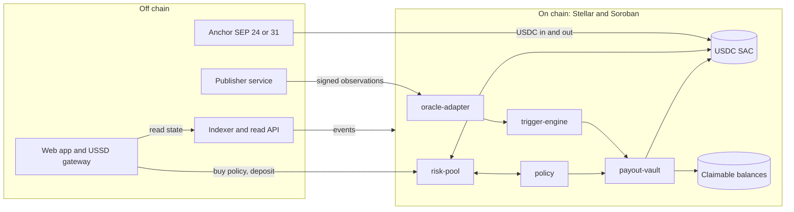
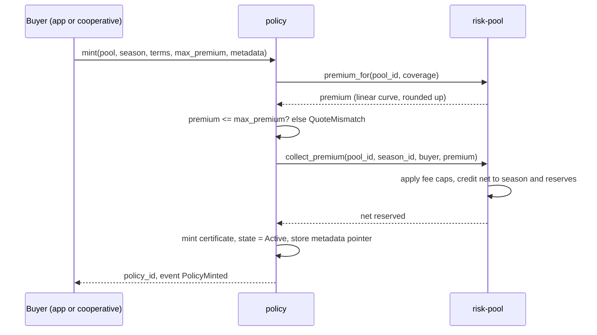

# Mvua Protocol Contracts: Architecture

- **Status:** v1 (Sprint 0.2, P0.2.1)
- **Scope:** the Soroban contract system only. Off chain services (publisher, indexer, web app) are described where they touch the contract boundary; their internals live in their own repositories.
- **Audience:** contributors implementing or reviewing contracts, auditors, and integrators.
- **Cross reference language:** PRD functional requirements (FR-*) and non functional requirements (NFR-*). Every module below cites the requirements it satisfies.
- **Change rule:** structural changes (new contract, new storage key, new cross contract call) require a decision record and update this document in the same pull request (see CONVENTIONS section 3).

## 1. Design principles

1. **Value safety first.** Every path that moves or commits value is a core concern: validated inputs, explicit errors, no panics (NFR-SEC-1), and a solvency invariant that holds at all times (FR-POOL-5).
2. **Determinism.** Index evaluation and payout math are pure functions of their inputs. No wall clock reads, no environment dependence; timestamps are passed in and validated (FR-TRG-3).
3. **Fail safe over fail open.** Missing or stale data blocks triggers rather than guessing (FR-ORC-4). Pausing stops new risk but never blocks an already finalized payout (FR-PAY-5).
4. **Least authority.** Each contract holds only the state it owns. Cross contract calls are explicit and narrow. Admin actions require the guardian multisig and, for parameters, a timelock (FR-GOV-1, FR-GOV-2).
5. **Separation of concerns.** Five contracts with single responsibilities, composed through well defined interfaces, rather than one monolith. This keeps each contract auditable and independently testable.
6. **No personal data on chain, ever.** Policies reference opaque identifiers only (NFR-PRIV-1).

## 2. System context

The protocol is the on chain core. Actors and services interact with it across a clear boundary.



Everything an external reader needs is emitted as events and served by the indexer (FR-ACC-2, NFR-OBS-1). The contracts never call out to off chain systems; data flows in only through signed, verified submissions.

## 3. Contract module map

Five contracts plus two shared library crates (`common` and `test-utils`). Each contract is a separate Wasm with its own storage; they never share storage, only call each other's published functions. The shared crates carry no on chain state: `common` is linked into every contract for cross cutting conventions, and `test-utils` is a dev dependency only.

| Contract | Responsibility | Owns | Requirements |
|---|---|---|---|
| `risk-pool` | Custody of premiums and tranche capital, deposits and withdrawals, season lifecycle, fee accounting, solvency enforcement | Pool config, tranche balances, receipt token supply, season state, treasury | FR-POOL-1 to 7, FR-ACC-1, FR-ACC-3 |
| `policy` | Policy certificate mint and state machine, premium quote, cancellation and refund, batch purchase, transferability flag | Policy records, per policy state, metadata pointers | FR-POL-1 to 6 |
| `oracle-adapter` | Publisher registry, signed observation ingestion and verification, median aggregation, staleness, challenge window, publisher fee ledger | Publisher keys, observation series per region and metric, challenge flags | FR-ORC-1 to 6 |
| `trigger-engine` | Index definitions, deterministic index evaluation, trigger state machine, per policy severity payout calculation | Index definitions, trigger state per region and window | FR-TRG-1 to 5 |
| `payout-vault` | Payout list computation, resumable batch payouts to claimable balances, payout events, emergency pause | Batch checkpoints, pause flag, payout ledger | FR-PAY-1 to 5 |
| `common` | Shared conventions linked into every contract: the shared error code range (900 to 999), value types (basis points), and storage TTL helpers | Nothing on chain (library) | supports NFR-SEC-1, section 6 |
| `test-utils` | Shared fixtures for tests only: environment and ledger builders, account and token fixtures, time advance, assertion helpers | Nothing on chain (dev dependency) | supports NFR-SEC-2, testing standards |

### 3.1 Why these boundaries

- **Custody is isolated in `risk-pool`.** Only one contract holds pooled value, so the solvency invariant has a single enforcement point (FR-POOL-5).
- **Data trust is isolated in `oracle-adapter`.** Signature verification and aggregation live in one place, so the trigger engine consumes an already trusted median series and stays a pure evaluator (FR-TRG-3).
- **Payout mechanics are isolated in `payout-vault`.** Batch resumability and claimable balance mechanics are complex and safety critical; keeping them separate keeps the trigger engine simple and the pause control (FR-PAY-5) narrowly scoped.
- **`policy` is the user facing record** and mediates between purchase (against `risk-pool`) and payout (via `payout-vault`), holding no value itself.

## 4. Key flows

### 4.1 Policy purchase



Premium custody lands in `risk-pool` before the certificate is marked active, so a policy never exists without its premium collected. The premium curve is a provisional linear model (`premium_for`, DR-0022), rounded up so integer truncation never underprices the pool. `policy` holds no value: it quotes and purchases against `risk-pool` over a cross contract client, and a cancellation before the coverage window opens refunds only the reserved net (fees are not reversed). Batch purchase (FR-POL-4) repeats the inner steps within instruction limits and is resumable on partial failure.

### 4.2 Observation to payout

```mermaid
sequenceDiagram
  participant PUB as Publisher
  participant OA as oracle-adapter
  participant TE as trigger-engine
  participant PV as payout-vault
  participant CB as Claimable balances
  PUB->>OA: submit(signed observation)
  OA->>OA: verify ed25519, store, drop if stale or forged
  Note over OA: median of last N valid per region and metric
  TE->>OA: read median series (region, metric, window)
  TE->>TE: evaluate index; if breached, state = triggered
  Note over TE: challenge window before finalize
  TE->>TE: finalize (irreversible)
  TE->>PV: finalized trigger (region, window, severity)
  PV->>PV: compute payout list for active policies
  loop resumable batches
    PV->>CB: create claimable balance per policy holder
    PV->>PV: checkpoint batch, emit PayoutMade
  end
```

A trigger must pass the challenge window (FR-ORC-5) before finalization, and finalization is irreversible (FR-TRG-4). Payouts are pull based: funds are placed in claimable balances (FR-PAY-3) so a farmer with no XLM can still receive them, with fee sponsorship covering the claim (FR-RAIL-1).

## 5. Storage model

Soroban storage has three durabilities: `Instance` (small, contract lifetime, bumped with the contract), `Persistent` (per entry, archivable, must be restored if it expires), and `Temporary` (cheap, expires without restore). This section is the authoritative storage layout. Adding or changing any key requires updating this table in the same pull request (CONVENTIONS section 3).

Key naming: a `#[contracttype]` enum named `DataKey` per contract, variants in `PascalCase`, documented inline. Composite keys carry their identifying fields.

### 5.1 risk-pool

| Key | Value | Durability | Notes |
|---|---|---|---|
| `Admin` | guardian config reference | Instance | Multisig address set at init |
| `PolicyContract` | policy contract address | Instance | Authorized caller of `refund_premium`; set by guardian via `set_policy_contract` |
| `PoolCount` | u64 | Instance | Monotonic pool id source; ids start at 1 |
| `SeasonCount(pool_id)` | u64 | Persistent | Monotonic season id source per pool; ids start at 1 |
| `PoolConfig(pool_id)` | token, region list, season length, premium curve params, tranche config, fee schedule, transferability default | Persistent | Immutable fields fixed at creation; parameter fields change only via timelock |
| `Tranche(pool_id, tier)` | deposited amount, receipt supply | Persistent | `tier` is Junior or Senior |
| `Receipt(pool_id, tier, holder)` | balance | Persistent | Pro rata claim on the tranche; internal ledger, not a token (DR-0020) |
| `Season(pool_id, season_id)` | state, opened_at, closes_at, premiums_in, payouts_committed, payouts_paid | Persistent | Lifecycle `Open -> Active -> Closed -> Settled`; `premiums_in` is net of fees |
| `Treasury(pool_id)` | protocol fees, publisher fees accrued | Persistent | Caps (`FeeConfig`) enforced on accrual in `collect_premium` |
| `Solvency(pool_id)` | reserves, committed | Persistent | Invariant: `reserves >= committed` at end of every mutating call |

### 5.2 policy

| Key | Value | Durability | Notes |
|---|---|---|---|
| `Admin` | guardian config reference | Instance | |
| `RiskPool` | risk-pool contract address | Instance | The pool policies quote and purchase against; set at init |
| `PolicyCounter` | u64 | Instance | Monotonic policy id source |
| `Policy(policy_id)` | owner, pool_id, season_id, region, coverage, index_ref, window_start, window_end, severity_curve, premium_paid, net_reserved, state | Persistent | State: Active, Triggered, Paid, Expired, Cancelled. `premium_paid` is gross; `net_reserved` (gross minus fees) is what a cancellation refunds |
| `MetaPointer(policy_id)` | opaque off chain reference (`BytesN<32>`) | Persistent | Content hash or URI digest; no PII on chain (NFR-PRIV-1) |
| `Transferable(pool_id)` | bool | Persistent | Default false (FR-POL-6) |

### 5.3 oracle-adapter

| Key | Value | Durability | Notes |
|---|---|---|---|
| `Admin` | guardian config reference | Instance | Registry changes are timelocked (FR-ORC-1) |
| `Publisher(pubkey)` | ed25519 public key, active flag, added_at | Persistent | Rotation and removal via timelocked admin |
| `Obs(region, metric, seq)` | value, timestamp, publisher, accepted flag | Persistent | Append only ring of the last N per region and metric |
| `ObsHead(region, metric)` | latest seq, count | Persistent | Supports median over last N |
| `Challenge(region, metric, seq)` | flagged by, reason code | Persistent | Set by guardians in the challenge window |
| `PublisherFee(pubkey)` | accrued | Persistent | Per accepted observation window (FR-ORC-6) |
| `StalenessBound` | hours | Instance | Fail safe threshold (FR-ORC-4) |

### 5.4 trigger-engine

| Key | Value | Durability | Notes |
|---|---|---|---|
| `Admin` | guardian config reference | Instance | Index definition changes are timelocked |
| `IndexDef(index_id)` | metrics, window, comparison, threshold, data source ref | Persistent | First class object (FR-TRG-1) |
| `TriggerState(region, window)` | Healthy, Triggered(at), Finalized(at, severity) | Persistent | Finalized is irreversible (FR-TRG-4) |
| `EvalCursor(region, window)` | last evaluated observation seq | Persistent | Determinism and replay safety |

### 5.5 payout-vault

| Key | Value | Durability | Notes |
|---|---|---|---|
| `Admin` | guardian config reference | Instance | |
| `Paused` | bool | Instance | Emergency pause (FR-PAY-5) |
| `Batch(region, window)` | total policies, cursor, state | Persistent | Resumable checkpoint (FR-PAY-2) |
| `Payout(policy_id)` | amount, claimable_balance_id, paid_at | Persistent | One payout per policy per finalized trigger (FR-PAY-4) |
| `PoolRef` | risk-pool address | Instance | Set at init; source of committed funds |

## 6. Error model

Every contract defines exactly one `#[contracterror]` enum. Error codes are numbered, documented, and never reused (CONVENTIONS section 3). To make an error legible from a block explorer without a lookup table, each contract owns a fixed code range:

| Contract | Code range | Example variants |
|---|---|---|
| `risk-pool` | 100 to 199 | `PoolNotFound` (100), `InsufficientReserves` (101), `SolvencyViolated` (102), `SeasonNotOpen` (103), `TrancheWithdrawBlocked` (104), `FeeCapExceeded` (105), `InvalidConfig` (106), `InvalidAmount` (107), `InsufficientReceipts` (108), `TrancheCapExceeded` (109), `InvalidSeasonState` (110), `SeasonNotFound` (111) |
| `policy` | 200 to 299 | `PolicyNotFound` (200), `InvalidState` (201), `WindowStarted` (202), `NotTransferable` (203), `QuoteMismatch` (204), `InvalidCoverage` (205), `InvalidWindow` (206), `NotExpired` (207) |
| `oracle-adapter` | 300 to 399 | `UnknownPublisher` (300), `BadSignature` (301), `ObservationStale` (302), `Challenged` (303), `RegistryTimelock` (304) |
| `trigger-engine` | 400 to 499 | `IndexNotFound` (400), `StaleIndex` (401), `AlreadyFinalized` (402), `NotTriggered` (403), `NonDeterministicInput` (404) |
| `payout-vault` | 500 to 599 | `Paused` (500), `BatchComplete` (501), `NoFinalizedTrigger` (502), `PayoutExists` (503) |
| shared or auth | 900 to 999 | `Unauthorized` (900), `TimelockPending` (901), `NotInitialized` (902), `Overflow` (903) |

Rules: variants carry enough context to debug from an explorer; the README error table is regenerated from source whenever errors change (P1.8.5); a payout or value moving function returns a typed error rather than panicking (NFR-SEC-1). Arithmetic uses checked operations and returns `Overflow` (903) rather than wrapping. The shared 900 to 999 codes are documented once in the `common` crate (`error_codes`); each contract still defines its own `#[contracterror]` enum and includes those variants with these exact numeric values, so a code reads the same from any contract.

## 7. Authorization model

Authorization is documented per function in rustdoc and tested with the SDK mock auth for unit tests and real auth in integration tests (CONVENTIONS section 3).

| Caller class | Can do | Cannot do |
|---|---|---|
| Anyone | Read state, quote a premium, buy a policy, deposit into a tranche | Mutate config, mint an unpaid policy, submit observations |
| Policy owner | Cancel before window start, claim a payout, transfer if the pool allows it | Change coverage or index after mint |
| Registered publisher | Submit signed observations for its keys | Register or remove publishers, finalize triggers |
| Guardian (any single) | Flag an observation in the challenge window, propose a timelocked change, trigger emergency pause | Execute a parameter change alone, move pooled funds |
| Guardian multisig (2 of 3) | Execute timelocked parameter changes, publisher set changes, upgrades, unpause | Bypass the timelock waiting period, reverse a finalized trigger |

Value moving functions authenticate the value owner: premium transfers require the buyer's auth, tranche deposits require the depositor's auth, and payouts require no farmer auth because they are pushed to claimable balances the farmer then claims. Admin functions require `Admin` auth, which resolves to the guardian multisig (FR-GOV-1). Parameter changes additionally require an elapsed timelock (FR-GOV-2), detailed in `UPGRADE-GOVERNANCE.md`.

## 8. Upgrade pattern

Contracts use a deploy and migrate pattern with a timelock; there is no unrestricted live mutation of logic (CONVENTIONS section 3, FR-GOV-3). At a high level: a new Wasm is announced, a timelock elapses, then the guardian multisig activates the new code and runs an explicit, per contract migration of storage if the layout changed. The full flow, guardian responsibilities, and per contract migration procedures are specified in `UPGRADE-GOVERNANCE.md` (P0.2.4).

## 9. Cross contract invariants

These hold across contract boundaries and are the backbone of the Phase 5 invariant suite (NFR-SEC-2):

1. **Solvency.** For every pool, `reserves >= sum(committed payouts not yet paid)` after every mutating call in any contract that can change either side (FR-POOL-5). `payout-vault` may only commit against reserves `risk-pool` confirms.
2. **Payout completeness.** When a trigger is finalized, every active policy in the affected region and window receives exactly one payout entry, and the batch is not marked complete until all are created (FR-PAY-1, FR-PAY-2).
3. **Trigger monotonicity.** A `TriggerState` moves Healthy to Triggered to Finalized only; Finalized never changes (FR-TRG-4).
4. **No payout without finalization.** `payout-vault` creates payouts only for a region and window whose `trigger-engine` state is Finalized (error 502 otherwise).
5. **Determinism.** Given the same stored observation series and index definition, `trigger-engine` produces the same evaluation every time (FR-TRG-3).
6. **Premium before policy.** A `Policy` is never `Active` unless its premium was accounted in `risk-pool` for the same season.

## 10. External interfaces

- **USDC via Stellar Asset Contract (SAC).** The pool token is a SAC address supplied at pool creation; the contracts hold and move it through the standard token interface. No custom token logic.
- **Claimable balances.** Payouts create native claimable balances with the farmer account as claimant and optional claim predicates, for example a 90 day claim window (FR-PAY-3).
- **ed25519 signatures.** Observation payloads are verified against registered publisher public keys using the host's ed25519 verification (FR-ORC-2).
- **Fee sponsorship.** Claim transactions are fee sponsored so a farmer needs no XLM (FR-RAIL-1); the sponsorship policy and caps are an app and rails concern (Phase 4) but the claimable balance design here enables it.

## 11. Open questions (resolve before or during Phase 1)

1. ~~Receipt token representation: internal ledger entries versus separate SAC token contracts per tranche.~~ **Resolved (DR-0020, 2026-09-25):** receipts are held as an internal per holder ledger (`Receipt(pool_id, tier, holder)`), not a separate token contract, for v1. Tranche transferability, if enabled, moves ledger balances within the contract.
2. Observation ring size N and staleness bound X: placeholders until the index spec backtests inform them (see `INDEX-SPEC.md`).
3. Whether `trigger-engine` reads `oracle-adapter` directly by cross contract call or receives a pushed median snapshot. Leaning direct read for a single source of truth; confirm in P1.6 and P1.7.
4. Claimable balance predicate policy (claim window length, reclaim of unclaimed funds to the pool). Confirm in P1.8.
