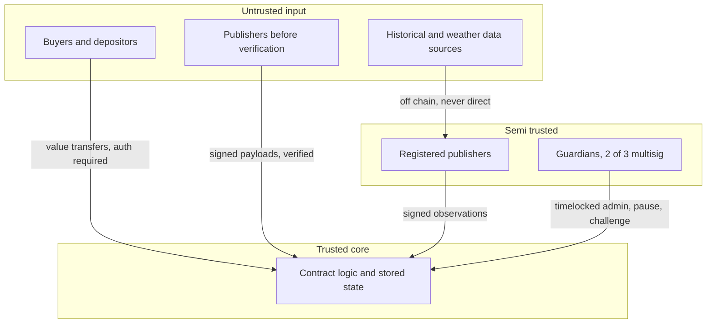

# Mvua Protocol Contracts: Threat Model

- **Status:** v0 (Sprint 0.2, P0.2.2)
- **Method:** asset centered analysis with trust boundaries and an adversary list, mitigations mapped to PRD requirement IDs. This is a living document; each phase revisits it, and Phase 5 (Hardening and Security) drives it to closure before audit.
- **Scope:** the Soroban contract system and the trust boundary at which off chain data and users meet it. Web app and publisher service internals are covered only where they cross that boundary.

## 1. Assets to protect

| Asset | Why it matters | Primary owner |
|---|---|---|
| Pooled capital (premiums and tranche deposits, USDC) | Direct financial loss if stolen or misaccounted | `risk-pool` |
| Pool solvency | An insolvent pool cannot pay valid claims, harming exactly the farmers the protocol protects | `risk-pool`, `payout-vault` |
| Payout correctness and completeness | Wrong or missing payouts break the core promise and trust | `trigger-engine`, `payout-vault` |
| Index data integrity | A corrupted index causes false triggers (drains the pool) or missed triggers (denies valid claims) | `oracle-adapter` |
| Determinism of evaluation | Non determinism makes outcomes disputable and unauditable | `trigger-engine` |
| Admin and guardian control | Compromise here compromises everything downstream | governance (FR-GOV) |
| Absence of personal data on chain | Privacy commitment and regulatory posture (NFR-PRIV-1) | `policy` |
| Availability of purchase and payout paths | Denial harms users even without theft | all contracts |

## 2. Trust boundaries

The core assumption: contract logic and its stored state are trusted once deployed and audited; everything crossing a boundary into it is validated. Guardians are semi trusted: powerful but constrained by multisig and timelock so that a single compromised key cannot act.

## 3. Adversaries

| Adversary | Motivation | Capability assumed |
|---|---|---|
| Opportunistic thief | Drain pooled funds | Can call any public function with crafted inputs; cannot forge auth or signatures |
| Malicious or compromised publisher | Force a false trigger for policies they hold, or suppress a real one | Controls one publisher key; can submit or withhold observations |
| Colluding publishers | Move the median toward a false value | Control a minority, then a majority, of publisher keys |
| Compromised guardian key | Push a self serving parameter change or unpause | Holds one of three guardian keys |
| Griefer | Deny service without direct profit | Can spam submissions, purchases, or challenges |
| Speculator | Buy protection to resell or arbitrage rather than to insure real risk | Ordinary user with capital |
| Curious observer | Deanonymize policy holders | Reads all on chain data and events |

## 4. Threats and mitigations

Numbered `T-n`. Each maps to the requirements that mitigate it and the tests that will prove it (Phase 5 unless noted).

### 4.1 Value and solvency

- **T-1 Withdraw beyond solvency.** A depositor withdraws while payouts are pending, leaving the pool unable to pay. Mitigation: solvency invariant blocks withdrawals that would underfund committed payouts (FR-POOL-3, FR-POOL-5); property test on all pool paths (NFR-SEC-2).
- **T-2 Premium underpayment or quote drift.** Buyer pays less than the quoted premium via a stale or manipulated quote. Mitigation: premium computed and collected atomically at purchase; `QuoteMismatch` (204) on divergence; premium accounted before the policy is `Active` (invariant 6 in ARCHITECTURE).
- **T-3 Fee inflation.** Admin or a bug routes excess value to the treasury. Mitigation: protocol and publisher fees are capped by pool parameters; `FeeCapExceeded` (105); parameter changes timelocked (FR-POOL-7, FR-GOV-2).
- **T-4 Arithmetic overflow or rounding drain.** Crafted large values overflow or rounding leaks value each cycle. Mitigation: checked arithmetic returning `Overflow` (903); rounding always favors the pool; boundary and fuzz tests (P5.1.2).

### 4.2 Oracle and data integrity

- **T-5 Forged observation.** Adversary submits an observation as a publisher they do not control. Mitigation: ed25519 verification against the registry; `BadSignature` (301), `UnknownPublisher` (300) (FR-ORC-1, FR-ORC-2).
- **T-6 Single publisher manipulation.** One malicious publisher pushes a false value. Mitigation: median aggregation over N valid observations from independent publishers dilutes a single outlier (FR-ORC-3); multi publisher test harness (P2.3).
- **T-7 Majority publisher collusion.** Enough publishers collude to move the median. Mitigation: guardian challenge window before finalization (FR-ORC-5); publisher rotation and removal via timelocked admin (FR-ORC-1); this residual risk is tracked and reduced by growing publisher independence (Phase 8 governance).
- **T-8 Stale data trigger.** A gap in data lets an old value drive a trigger. Mitigation: staleness bound marks the index stale and blocks triggers; fail safe, not fail open (FR-ORC-4); `StaleIndex` (401).
- **T-9 Replay or duplicate submission.** The same observation is counted twice to skew the median. Mitigation: append only sequence per region and metric with de duplication on (publisher, timestamp); accepted flag prevents double counting.

### 4.3 Trigger and payout

- **T-10 Non deterministic evaluation.** Evaluation depends on call order, ledger time, or hidden state, making outcomes disputable. Mitigation: index evaluation is a pure function of stored inputs; no wall clock reads; `EvalCursor` makes replay deterministic (FR-TRG-3); determinism invariant (NFR-SEC-2).
- **T-11 Reversing a finalized trigger.** An adversary or admin tries to undo a finalized trigger to avoid paying. Mitigation: `TriggerState` is monotonic and Finalized is irreversible (FR-TRG-4); `AlreadyFinalized` (402); no admin path reverses it.
- **T-12 Payout to wrong or duplicate recipients.** A policy is paid twice, or a non qualifying policy is paid. Mitigation: one `Payout(policy_id)` entry per finalized trigger with `PayoutExists` (503) guard; payout list computed only for active policies in the affected region and window (FR-PAY-1); payout completeness invariant.
- **T-13 Batch failure strands payouts.** A batch fails partway and some farmers never get paid. Mitigation: resumable batches with per batch checkpoints; the batch is not complete until all entries exist (FR-PAY-2); `BatchComplete` (501) guards re entry.
- **T-14 Payout blocked by pause.** An operator pauses to avoid a legitimate payout. Mitigation: pause stops new purchases and new triggers only; an already finalized trigger always pays (FR-PAY-5). This is a deliberate limit on admin power.

### 4.4 Authorization and governance

- **T-15 Single key admin takeover.** One compromised operator key changes parameters or drains value. Mitigation: admin resolves to a 2 of 3 guardian multisig (FR-GOV-1); no single guardian can execute a change.
- **T-16 Instant malicious parameter change.** A change is pushed before anyone can react. Mitigation: parameter, publisher set, and index definition changes go through a public timelock (FR-GOV-2); `TimelockPending` (901), `RegistryTimelock` (304).
- **T-17 Malicious upgrade.** A guardian set installs harmful logic. Mitigation: deploy and migrate pattern with an announcement to activation timelock and explicit migration; documented per contract in `UPGRADE-GOVERNANCE.md` (FR-GOV-3). Residual trust in the guardian set is reduced over time (Phase 8).

### 4.5 Privacy and misuse

- **T-18 Personal data leak on chain.** PII ends up in policy records or events. Mitigation: policies reference opaque identifiers only; metadata resolves off chain; reviewer checklist and CI guard against PII (NFR-PRIV-1, FR-POL-5).
- **T-19 Speculative resale of protection.** Certificates are traded as instruments rather than held as insurance. Mitigation: transferability is off by default per pool (FR-POL-6).
- **T-20 Griefing via spam.** Flooding submissions, purchases, or challenges to raise costs or clog batches. Mitigation: publisher allow list bounds observation spam; per call fees and validation bound purchase and challenge spam; batch design tolerates load (NFR-PERF-2). Tracked for tuning in Phase 6 operations.

## 5. Residual risks (accepted or deferred)

1. **Majority publisher collusion (T-7)** cannot be fully eliminated by code; it is bounded by the challenge window and reduced by publisher independence over time. Tracked as a governance concern.
2. **Basis risk** (index pays when the farm is fine, or the reverse) is a product risk, not a contract vulnerability; mitigated by index methodology, regional granularity, and backtests (PRD section 11, `INDEX-SPEC.md`).
3. **Guardian set trust** is a launch reality; the graduated launch caps (Phase 7) and progressive decentralization (Phase 8) bound the damage a compromised set can do.

## 6. Verification plan

- Every `T-n` above has at least one test by Phase 5, tagged in the test name (for example `t5_rejects_forged_observation`).
- Invariants (solvency, determinism, payout completeness) run as property tests in CI (NFR-SEC-2).
- The adversarial review pass (P5.2.2) walks this list function by function.
- External audit (P5.3) receives this document as part of the audit preparation package (P5.3.1).
