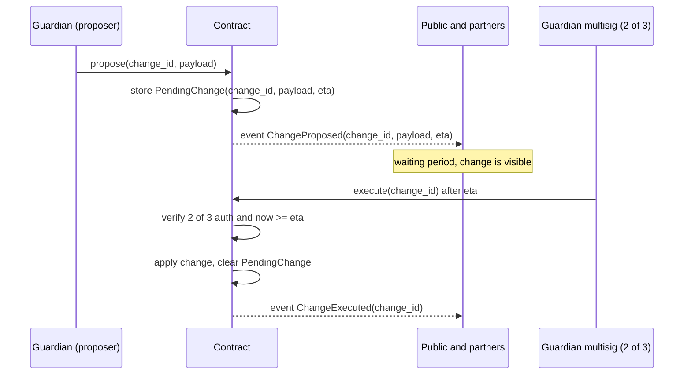

# Mvua Protocol Contracts: Upgrade and Governance

- **Status:** v0 (Sprint 0.2, P0.2.4)
- **Purpose:** specify how the protocol is administered safely: who holds authority (guardian multisig), how changes are made without surprise (timelock), and how contract logic is upgraded (deploy and migrate). Maps to FR-GOV-1, FR-GOV-2, FR-GOV-3 and the upgrade principle in CONVENTIONS section 3.
- **Doctrine:** no single key can move value or change behavior; no change to parameters or logic takes effect without a public waiting period; an emergency pause can protect users quickly but can never reverse a finalized payout.

## 1. Guardian multisig

Authority is held by a guardian set, starting at **2 of 3** operator keys (FR-GOV-1). The `Admin` entry in every contract resolves to this multisig address.

| Guardian action | Signatures | Timelock | Notes |
|---|---|---|---|
| Propose a parameter change | 1 | Starts the clock | Any single guardian may propose; proposal is public |
| Execute a parameter change | 2 of 3 | After waiting period | Cannot execute early |
| Publisher add or remove | 2 of 3 | After waiting period | Registry change (FR-ORC-1) |
| Index definition add | 2 of 3 | After waiting period | New `index_id`; never mutates a referenced definition |
| Contract upgrade activation | 2 of 3 | After the longer upgrade period | Deploy and migrate (section 4) |
| Emergency pause | 1 | Immediate | Protective only; stops new risk (FR-PAY-5) |
| Unpause | 2 of 3 | Immediate | Requires the full multisig to resume |
| Flag observation in challenge window | 1 | Within window | Does not finalize anything (FR-ORC-5) |

Rationale for the asymmetry: pausing is a single guardian action because speed protects users, but unpausing and every change that alters terms or value needs the full multisig. Guardian responsibilities, key custody, and rotation are documented in the operations runbooks (Phase 6) and expanded toward decentralization in Phase 8.

## 2. Change categories and timelock durations

Durations are provisional until the Phase 6 operations review; they are parameters, not code constants where possible.

| Category | Examples | Provisional timelock |
|---|---|---|
| Economic parameters | fee caps, premium curve params, staleness bound | 72 hours |
| Trust set changes | publisher add or remove, guardian rotation | 7 days |
| New index definitions | adding an `IndexDef` for a region | 72 hours |
| Contract upgrade | new Wasm activation | 14 days |
| Emergency pause | halt new purchases and triggers | none (immediate) |

A longer window for trust set and upgrade changes gives the public and partners time to react, including exiting a pool before a change they disagree with takes effect.

## 3. Timelock flow for parameter changes

Rules enforced by the contract:

1. `execute` before `eta` returns `TimelockPending` (901); registry variants return `RegistryTimelock` (304).
2. A pending change is fully described in its proposal event so anyone can inspect exactly what will happen.
3. A pending change can be cancelled by the multisig; cancellation is also public.
4. Only one pending change per `change_id` domain at a time, to avoid ambiguous ordering.

## 4. Upgrade procedure (deploy and migrate)

Contracts do not mutate logic in place. An upgrade replaces the Wasm and, if storage changed, runs an explicit migration (FR-GOV-3). The flow, per contract:

1. **Announce.** A guardian proposes the upgrade with the new Wasm hash and a migration note; this starts the 14 day upgrade timelock and emits a public event.
2. **Review.** The new code is public (source and reproducible build) for the full window. If it changes storage, the migration steps are published with it.
3. **Activate.** After the window, the multisig (2 of 3) sets the new Wasm.
4. **Migrate.** If the storage layout changed, a one time `migrate` entry point runs the documented transformation, guarded so it can run only once and only by the multisig.
5. **Verify.** Post upgrade checks confirm invariants still hold (solvency, monotonic triggers) before normal operation resumes.

Storage layout changes are recorded in ARCHITECTURE section 5 in the same pull request that introduces them (CONVENTIONS section 3), so the migration always has an authoritative before and after.

## 5. Per contract migration notes

Each contract documents its own migration considerations. These are the standing notes; a specific upgrade appends its concrete steps.

| Contract | Migration sensitivity | Standing note |
|---|---|---|
| `risk-pool` | High: holds value and solvency state | Never migrate with an open, unsettled season if avoidable; if unavoidable, snapshot `Solvency` and `Season` and assert equality after migration |
| `policy` | Medium: policy records must keep their original terms | Migration must not alter `index_ref`, coverage, or window of existing policies |
| `oracle-adapter` | Medium: observation history and publisher set | Preserve the accepted flag and sequence integrity; do not drop history that a pending evaluation depends on |
| `trigger-engine` | High: finalized triggers are irreversible | A migration must never move a `Finalized` state backward; assert monotonicity after migration |
| `payout-vault` | High: in flight batches | Do not migrate mid batch; drain or checkpoint all batches first, then assert payout completeness for finalized triggers |

## 6. Guardian key custody and rotation

- Keys are held on separate hardware by separate operators; no two guardian keys share a device or a person.
- Rotation (replacing a guardian key) is a trust set change: 7 day timelock, 2 of 3 to execute, publicly announced.
- The graduated launch (Phase 7) and progressive decentralization (Phase 8) expand the guardian set and add community parameter proposals for non critical parameters, reducing the trust concentrated in the initial set.
- Every guardian action is an on chain event; the public transparency reporting (Phase 7) summarizes them.
